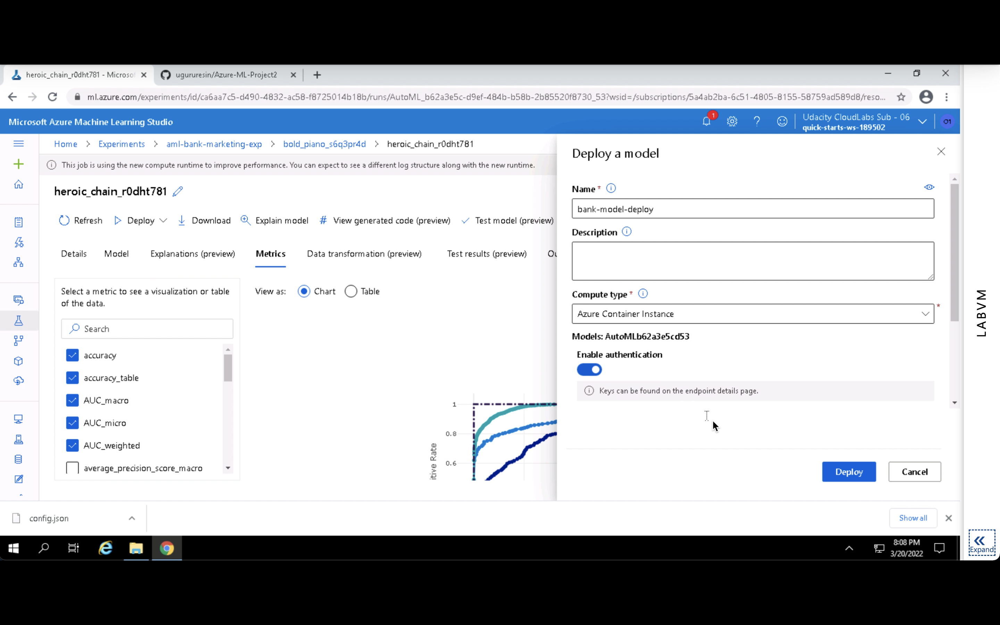

# Operationalizing Machine Learning

## Table of Content
* [Overview](#overview)
* [The Architecture](#the-architecture)
* [Project Main Steps](#key-steps)
    * [1. Authentication](#authentication)
    * [2. Automated ML Experiment](#automated-ml-experiment)
    * [3. Deploy the best model](#deploy-the-best-model)
    * [4. Enable logging](#enable-logging)
    * [5. Swagger Documentation](#swagger-documentation)
    * [6. Consume model endpoints](#consume-model-endpoints)
    * [7. Create and publish a pipeline](#create-and-publish-a-pipeline)
    * [8. Documentation](#documentation)
* [Screen Recording](#screen-recording)
* [Future Improvements](#future-improvements)

## Overview
This project is part of the Udacity Azure ML Nanodegree.
In this project, The Azure service is used to configure a cloud-based machine learning production model with Bank Marketing dataset. Then the model is deployed and consumed. In addition, a pipeline is created, published, and consumed. These steps are documented in this README file and also a screen cast was recorded whose link is provided here.

## The Architecture
These are the steps we followed in this project :

1. **Authentication** : In this step, we need to create a Security Principal (SP) to interact with the Azure Workspace. (Since I do not have permission to crate a SP in Udacity Lab, this step is skipped)
2. **Automated ML Experiment** : In this step, we create an experiment using Automated ML, configure a compute cluster, and use that cluster to run the experiment.
3. **Deploy the best model** : Deploying the Best Model will allow us to interact with the HTTP API service and interact with the model by sending data over POST requests.
4. **Enable logging** : Logging helps monitor our deployed model. It helps us know the number of requests it gets, the time each request takes, etc.
5. **Swagger Documentation** : In this step, we consume the deployed model using Swagger.
6. **Consume model endpoints** : We interact with the endpoint using some test data to get inference.
7. **Create and publish a pipeline** : In this step, we automate this workflow by creating a pipeline with the Python SDK.

## Key Steps  
First the dataset is loaded

  
  
  
  
  

Then, a compute cluster is created  
  
Using the dataset and the cluster, an AutoML experiment is setup  
  
The task is selected as classification since the target label is a categorical variable ('yes', 'no')  
  
The metric is set to AUC and Training hour is limited with 1 hour 
  
The AutoML is started train different ML models to find out the best fitting algorithm  
  
The AutoML completed its run less than an hour
  
The best model metrics are 0.917 accuracy, 0.948 AUC_macro, 0.981 AUC_micro, 0.948 AUC_weighted  
  
The precision-recall graph is shown below  
  
The ROC curve is shown below  
  
Then the model is deployed, the compute type is selected as ACI  
  
Then the applications insights are enabled using 'service.update(enable_app_insights=True' (line14)  
  
The model deployment is done succesfully  

Then the logs.py is run  
  
The swagger.json file is downloaded and imported to the working directory  

Using Git Bash, the swagger.sh and the serve.py files are triggered respectively  
  
Then the deployed model is accessed via swagger using localhost:8000/swagger.json adress
  
  
Endpoint is consumed using the REST endpoint and the primary key  
  

**endpoint.py script runs against the API producing JSON output from the model.**  
The default script did not work, I changed it based on AzureML code snipsets.  
  

As a second part of this project, the aml-pipelines-with-automated-machine-learning-step Jupyter Notebook is used to create a Pipeline.  
Then, it's consumed and published the best model for the bank marketing dataset using AutoML with Python SDK.  
  

**Note: There was a environment issue to save the best model, end no time left in the virtual environment to replicate the environment.**

The pipeline runs and the endpoint is created successfully  
  
  
 
And finally, the REST endpoint in Azure ML Studio, with a status of ACTIVE.
 

## Screen Recording with Subtitles
[Youtube Link](https://www.youtube.com/watch?v=5iA5eBRqGTU)

## Standout Suggestions
* The data was imbalanced and this leads a biased model that yields biased predictions. The imbalance issue would be handled as one or more of the following techniques  
1.) Upsampling Minority Class  
2.) Downsampling Majority Class  
3.) Generate Synthetic Data  
4.) Combine Oversampling and Undersampling Techniques  
5.) Balanced Class Weight  

* For better metrics, the deep learning would be enabled in AutoML experimentation, however, this will increase the computation time.

